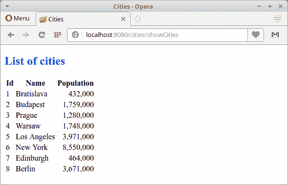

# Spring Boot FreeMarker 教程

> 原文： [http://zetcode.com/springboot/freemarker/](http://zetcode.com/springboot/freemarker/)

在 Spring Boot FreeMarker 教程中，我们将使用 FreeMarker 模板引擎和 H2 数据库创建一个简单的 Spring Boot Web 应用。

Spring 是流行的 Java 应用框架。 Spring Boot 致力于创建独立的，基于生产级别的基于 Spring 的应用，而无任何麻烦。

H2 是完全用 Java 创建的开源关系数据库管理系统。 它可以嵌入 Java 应用中或以客户端-服务器模式运行。 它易于部署和安装，占地面积小。

## FreeMarker

FreeMarker 是适用于 Web 和独立环境的服务器端 Java 模板引擎。 模板使用 FreeMarker 模板语言（FTL）编写，这是一种简单的专用语言。

## Spring Boot FreeMarker 示例

以下示例使用 FreeMarker 模板引擎。

```java
pom.xml
src
└── main
    ├── java
    │   └── com
    │        └── zetcode
    │           ├── Application.java
    │           ├── model
    │           │   └── City.java
    │           ├── controller
    │           │   └── MyController.java
    │           └── service
    │               ├── CityService.java
    │               └── ICityService.java
    └── resources
        ├── application.yml
        ├── data-h2.sql
        ├── schema-h2.sql
        ├── static
        │   └── css
        │       └── style.css
        └── templates
            ├── index.ftl
            └── showCities.ftl

```

这是项目结构。 FreeMarker 模板文件的后缀为`.ftl`； 它们默认位于`src/main/resources/template`目录中。 当 Spring Boot 在 Maven POM 文件中找到依赖关系时，它将自动配置 FreeMarker。

`pom.xml`

```java
<?xml version="1.0" encoding="UTF-8"?>
<project xmlns="http://maven.apache.org/POM/4.0.0"
         xmlns:xsi="http://www.w3.org/2001/XMLSchema-instance"
         xsi:schemaLocation="http://maven.apache.org/POM/4.0.0
http://maven.apache.org/xsd/maven-4.0.0.xsd">

    <modelVersion>4.0.0</modelVersion>
    <groupId>com.zetcode</groupId>
    <artifactId>springbootfreemarkerex</artifactId>
    <version>1.0-SNAPSHOT</version>
    <packaging>jar</packaging>

    <properties>
        <project.build.sourceEncoding>UTF-8</project.build.sourceEncoding>
        <maven.compiler.source>11</maven.compiler.source>
        <maven.compiler.target>11</maven.compiler.target>
    </properties>

    <parent>
        <groupId>org.springframework.boot</groupId>
        <artifactId>spring-boot-starter-parent</artifactId>
        <version>2.1.1.RELEASE</version>
    </parent>

    <dependencies>

        <dependency>
            <groupId>com.h2database</groupId>
            <artifactId>h2</artifactId>
            <scope>runtime</scope>
        </dependency>

        <dependency>
            <groupId>org.springframework.boot</groupId>
            <artifactId>spring-boot-starter-web</artifactId>
        </dependency>

        <dependency>
            <groupId>org.springframework.boot</groupId>
            <artifactId>spring-boot-starter-freemarker</artifactId>
        </dependency>

        <dependency>
            <groupId>org.springframework.boot</groupId>
            <artifactId>spring-boot-starter-jdbc</artifactId>
        </dependency>
    </dependencies>

    <build>
        <plugins>
            <plugin>
                <groupId>org.springframework.boot</groupId>
                <artifactId>spring-boot-maven-plugin</artifactId>
            </plugin>
        </plugins>
    </build>
</project>

```

这是 Maven 构建文件。 `h2`包添加了 H2 数据库。 `spring-boot-devtools`启用热插拔，禁用模板缓存并启用实时重载。 `spring-boot-starter-web`用于使用 Spring MVC 构建包括 RESTful 在内的 Web 应用。 它使用 Tomcat 作为默认的嵌入式容器。 `spring-boot-starter-freemarker`是用于使用 FreeMarker 构建 Spring MVC 应用的入门程序。 `spring-boot-starter-jdbc`是在 Spring Boot 中使用 JDBC 的入门工具。

`com/zetcode/model/City.java`

```java
package com.zetcode.model;

import java.util.Objects;

public class City {

    private Long id;
    private String name;
    private int population;

    public City() {
    }

    public City(Long id, String name, int population) {
        this.id = id;
        this.name = name;
        this.population = population;
    }

    public Long getId() {
        return id;
    }

    public void setId(Long id) {
        this.id = id;
    }

    public String getName() {
        return name;
    }

    public void setName(String name) {
        this.name = name;
    }

    public int getPopulation() {
        return population;
    }

    public void setPopulation(int population) {
        this.population = population;
    }

    @Override
    public int hashCode() {
        int hash = 7;
        hash = 29 * hash + Objects.hashCode(this.id);
        hash = 29 * hash + Objects.hashCode(this.name);
        hash = 29 * hash + this.population;
        return hash;
    }

    @Override
    public boolean equals(Object obj) {
        if (this == obj) {
            return true;
        }
        if (obj == null) {
            return false;
        }
        if (getClass() != obj.getClass()) {
            return false;
        }
        final City other = (City) obj;
        if (this.population != other.population) {
            return false;
        }
        if (!Objects.equals(this.name, other.name)) {
            return false;
        }
        if (!Objects.equals(this.id, other.id)) {
            return false;
        }
        return true;
    }

    @Override
    public String toString() {
        final StringBuilder sb = new StringBuilder("City{");
        sb.append("id=").append(id);
        sb.append(", name='").append(name).append('\'');
        sb.append(", population=").append(population);
        sb.append('}');
        return sb.toString();
    }
}

```

这是`City` bean 类。 它包含商品 ID，名称和数量。

`resources/application.yml`

```java
server:
  servlet:
    context-path: /cities

spring:
  main:
    banner-mode: "off"
datasource:
    platform: h2

logging:
  level:
    org:
      springframework: ERROR

```

`application.yml`是主要的 Spring Boot 配置文件。 `context-path`定义 Web 应用的名称。 使用`banner-mode`属性，我们可以关闭 Spring 横幅。 该平台值用在 SQL 初始化脚本中：`schema-${platform}.sql`和`data-${platform}.sql`。 另外，我们将 spring 框架的日志记录级别设置为`ERROR`。

注意，我们没有配置数据源。 如果没有配置数据，Spring 会以内存模式自动配置 H2。 我们希望有一个内存数据库，因此我们让 Spring 进行自动配置。

`resources/schema-h2.sql`

```java
CREATE TABLE cities(id INT PRIMARY KEY AUTO_INCREMENT,
        name VARCHAR(255), population INT);

```

该 SQL 脚本创建`cities`表。

`resources/data-h2.sql`

```java
INSERT INTO cities(name, population) VALUES('Bratislava', 432000);
INSERT INTO cities(name, population) VALUES('Budapest', 1759000);
INSERT INTO cities(name, population) VALUES('Prague', 1280000);
INSERT INTO cities(name, population) VALUES('Warsaw', 1748000);
INSERT INTO cities(name, population) VALUES('Los Angeles', 3971000);
INSERT INTO cities(name, population) VALUES('New York', 8550000);
INSERT INTO cities(name, population) VALUES('Edinburgh', 464000);
INSERT INTO cities(name, population) VALUES('Berlin', 3671000);

```

该脚本用数据填充表。 这两个脚本都位于类路径的根目录中。

`com/zetcode/model/ICityService.java`

```java
package com.zetcode.service;

import com.zetcode.model.City;
import java.util.List;

public interface ICityService {

    List<City> findAll();
}

```

`ICityService`提供了一种从数据源获取所有城市的契约方法。

`com/zetcode/service/CityService.java`

```java
package com.zetcode.service;

import com.zetcode.model.City;
import java.util.List;
import org.springframework.beans.factory.annotation.Autowired;
import org.springframework.jdbc.core.BeanPropertyRowMapper;
import org.springframework.jdbc.core.JdbcTemplate;
import org.springframework.stereotype.Service;

@Service
public class CityService implements ICityService {

    @Autowired
    private JdbcTemplate jdbcTemplate;

    @Override
    public List<City> findAll() {

        var sql = "SELECT * FROM cities";

        return jdbcTemplate.query(sql, new BeanPropertyRowMapper<>(City.class));
    }
}

```

`CityService`包含`findAll()`方法的实现。 我们借助`JdbcTemplate`从`cities`表中检索所有城市。

```java
@Autowired
private JdbcTemplate jdbcTemplate;

```

注入`JdbcTemplate`。

```java
var sql = "SELECT * FROM CITIES";

```

这是要执行的 SQL。 我们从`CITIES`表中选择所有城市。

```java
return jdbcTemplate.query(sql, new BeanPropertyRowMapper<>(City.class));

```

`BeanPropertyRowMapper`将一行转换为指定映射目标类的新实例。

`com/zetcode/controller/MyController.java`

```java
package com.zetcode.controller;

import com.zetcode.service.ICityService;
import org.springframework.beans.factory.annotation.Autowired;
import org.springframework.stereotype.Controller;
import org.springframework.ui.Model;
import org.springframework.web.bind.annotation.GetMapping;
import org.springframework.web.servlet.ModelAndView;

import java.util.HashMap;

@Controller
public class MyController {

    @Autowired
    private ICityService cityService;

    @GetMapping("/")
    public String index(Model model) {

        return "index";
    }

    @GetMapping("/showCities")
    public ModelAndView showCities() {

        var cities = cityService.findAll();

        var params = new HashMap<String, Object>();
        params.put("cities", cities);

        return new ModelAndView("showCities", params);
    }
}

```

这是 Spring Boot Web 应用的控制器类。 控制器以`@Controller`注解修饰。 控制器具有两个映射：一个用于主页的映射，一个用于列出所有城市的映射。 当 Spring Boot 在 Maven POM 文件中检测到 FreeMarker 启动程序时，它将自动配置 FreeMarker 视图。

```java
@Autowired
private ICityService cityService;

```

我们将`ICityService`注入到带有`@Autowired`注解的字段中。

```java
@GetMapping("/")
public String index(Model model) {

    return "index";
}

```

`index`是位于预定义`template`目录中的视图的名称。

```java
@GetMapping("/showCities")
public ModelAndView showCities() {

    var cities = cityService.findAll();

    var params = new HashMap<String, Object>();
    params.put("cities", cities);

    return new ModelAndView("showCities", params);
}

```

此控制器方法可提供城市列表。 我们从城市服务中找到所有城市对象，并将结果列表放入参数中。 Spring 将找到名为`showCities`的 FreeMarker 视图，并让引擎将模板与模型数据连接在一起。

`resources/static/css/style.css`

```java
h2 {color: blue}

td:nth-child(3) {
    text-align: right;
}

```

`style.css`是位于`src/main/resources/static/css`目录中的静态文件。 它将 H2 标签设置为蓝色，并右对齐第三列的数据。

`resources/templates/index.ftl`

```java
<!DOCTYPE html>
<html>
    <head>
        <title>Home page</title>
        <meta charset="UTF-8">
        <meta name="viewport" content="width=device-width, initial-scale=1.0">
    </head>

    <body>
        <a href="showCities">Show cities</a>
    </body>

</html>

```

`index.ftl`模板文件是应用的主页。 它包含一个检索所有城市的链接。

`resources/templates/showCities.ftl`

```java
<!DOCTYPE html>
<html>
    <head>
        <title>Cities</title>
        <meta charset="UTF-8">
        <meta name="viewport" content="width=device-width, initial-scale=1.0">
        <link rel="stylesheet" href="css/style.css">
        </head>
    <body>
        <h2>List of cities</h2>

        <table>
            <tr>
                <th>Id</th>
                <th>Name</th>
                <th>Population</th>
            </tr>

            <#list cities as city>
                <tr>
                    <td>${city.id}</td>
                    <td>${city.name}</td>
                    <td>${city.population}</td>
                </tr>
            </#list>
        </table>

    </body>
</html>

```

`showCities.ftl`是一个 FreeMarker 模板文件，其中包含要用来自模型的数据填充的占位符。 要访问数据，我们使用`${}`变量表达式。

```java
<link rel="stylesheet" href="css/style.css">

```

我们包括静态 CSS 文件。

```java
<#list cities as city>
    <tr>
        <td>${city.id}</td>
        <td>${city.name}</td>
        <td>${city.population}</td>
    </tr>
</#list>

```

我们遍历城市列表，并将每个城市的详细信息放入一个表格行中。 `#list`指令用于列出数据集合。

`com/zetcode/Application.java`

```java
package com.zetcode;

import org.springframework.boot.SpringApplication;
import org.springframework.boot.autoconfigure.SpringBootApplication;

@SpringBootApplication
public class Application {

    public static void main(String[] args) {
        SpringApplication.run(Application.class, args);
    }
}

```

我们设置了 Spring Boot 应用。 `@SpringBootApplication`注解启用自动配置和组件扫描。



图：列出城市

该应用部署在内置的 Tomcat 服务器上，该服务器侦听端口 8080。

在本教程中，我们使用 FreeMarker 和 H2 创建了一个 Spring Boot Web 应用。 您可能也对相关教程感兴趣： [FreeMarker 教程](/java/freemarker/)， [Java 教程](/lang/java/)或列出[所有 Spring Boot 教程](/all/#springboot)。