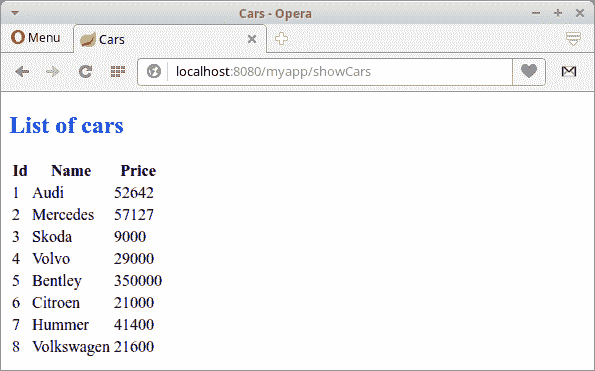

# Spring Boot Thymeleaf 教程

> 原文： [http://zetcode.com/articles/springbootthymeleaf/](http://zetcode.com/articles/springbootthymeleaf/)

在 Spring Boot Thymeleaf 教程中，我们将创建一个简单的 Spring Boot Web 应用程序。 该应用程序使用 Thymeleaf 模板引擎和 H2 数据库。

Spring 是流行的 Java 应用程序框架。 Spring Boot 致力于以最小的努力创建独立的，基于生产级别的基于 Spring 的应用程序。

H2 是完全用 Java 创建的开源关系数据库管理系统。 它可以嵌入 Java 应用程序中或以客户端-服务器模式运行。 它易于部署和安装，占地面积小。

## 胸腺

Thymeleaf 是适用于 Web 和独立环境的现代服务器端 Java 模板引擎。 它基于自然模板的概念：模板文件可以在浏览器中直接打开，并且仍然可以正确显示为网页。 当 Spring Boot 在 Maven POM 文件中找到依赖项时，它将自动配置 Thymeleaf。

## Spring Boot Thymeleaf 示例

下一个示例创建一个使用 Thymeleaf 引擎的 Spring Boot Web 应用程序。 数据存储在 H2 数据库中。

```java
$ tree
.
├── pom.xml
└── src
    ├── main
    │   ├── java
    │   │   └── com
    │   │       └── zetcode
    │   │           ├── Application.java
    │   │           ├── bean
    │   │           │   └── Car.java
    │   │           ├── controller
    │   │           │   └── MyController.java
    │   │           └── service
    │   │               ├── CarService.java
    │   │               └── ICarService.java
    │   └── resources
    │       ├── application.yml
    │       ├── data-h2.sql
    │       ├── schema-h2.sql
    │       ├── static
    │       │   └── css
    │       │       └── style.css
    │       └── templates
    │           ├── index.html
    │           └── showCars.html
    └── test
        └── java

```

这是项目结构。 Thymeleaf 模板文件默认位于`src/main/resources/template`目录中。

`pom.xml`

```java
<?xml version="1.0" encoding="UTF-8"?>
<project xmlns="http://maven.apache.org/POM/4.0.0" 
         xmlns:xsi="http://www.w3.org/2001/XMLSchema-instance" 
         xsi:schemaLocation="http://maven.apache.org/POM/4.0.0 
                             http://maven.apache.org/xsd/maven-4.0.0.xsd">

    <modelVersion>4.0.0</modelVersion>
    <groupId>com.zetcode</groupId>
    <artifactId>SpringBootThymeleaf</artifactId>
    <version>1.0-SNAPSHOT</version>
    <packaging>war</packaging>
    <properties>
        <project.build.sourceEncoding>UTF-8</project.build.sourceEncoding>
        <maven.compiler.source>1.8</maven.compiler.source>
        <maven.compiler.target>1.8</maven.compiler.target>
    </properties>

    <parent>
        <groupId>org.springframework.boot</groupId>
        <artifactId>spring-boot-starter-parent</artifactId>
        <version>1.5.3.RELEASE</version>
    </parent>    

    <dependencies>

        <dependency>
            <groupId>com.h2database</groupId>
            <artifactId>h2</artifactId>
            <scope>runtime</scope>
        </dependency>

        <dependency>
            <groupId>org.springframework.boot</groupId>
            <artifactId>spring-boot-devtools</artifactId>
            <optional>true</optional>
        </dependency>                        

        <dependency>
            <groupId>org.springframework.boot</groupId>
            <artifactId>spring-boot-starter-thymeleaf</artifactId>
        </dependency>    

        <dependency>
            <groupId>org.springframework.boot</groupId>
            <artifactId>spring-boot-starter-jdbc</artifactId>
        </dependency>         

    </dependencies>    

    <build>
        <plugins>
            <plugin>
                <groupId>org.springframework.boot</groupId>
                <artifactId>spring-boot-maven-plugin</artifactId>
            </plugin>            
        </plugins>
    </build>

</project>

```

这是 Maven 构建文件。 `spring-boot-devtools`启用热插拔，禁用模板缓存并启用实时重新加载。 `spring-boot-starter-thymeleaf`是使用 Thymeleaf 构建 Spring MVC 应用程序的入门工具。 `spring-boot-starter-jdbc`是在 Spring Boot 中使用 JDBC 的入门工具。

`Car.java`

```java
package com.zetcode.bean;

public class Car {

    private Long id;
    private String name;
    private int price;

    public Car() {}

    public Car(Long id, String name, int price) {
        this.id = id;
        this.name = name;
        this.price = price;
    }

    public Long getId() {
        return id;
    }

    public void setId(Long id) {
        this.id = id;
    }

    public String getName() {
        return name;
    }

    public void setName(String name) {
        this.name = name;
    }

    public int getPrice() {
        return price;
    }

    public void setPrice(int price) {
        this.price = price;
    }

    @Override
    public String toString() {
        return "Car{" + "id=" + id + ", name=" + name + ", price=" + price + '}';
    }
}

```

这是`Car` bean 类。 它包含商品 ID，名称和价格。

`application.yml`

```java
server:
    context-path: /myapp

spring: 
    main:
        banner-mode: "off"       
    datasource:
        platform: h2

logging: 
    level: 
        org: 
            springframework: ERROR

```

`application.yml`是主要的 Spring Boot 配置文件。 `context-path`定义 Web 应用程序的名称。 使用`banner-mode`属性，我们可以关闭 Spring 标语。 该平台值用在 SQL 初始化脚本中：`schema-${platform}.sql`和`data-${platform}.sql`。 另外，我们将 spring 框架的日志记录级别设置为 ERROR。

注意，我们没有配置数据源。 如果没有配置数据，Spring 会以内存模式自动配置 H2。 我们希望有一个内存数据库，因此我们让 Spring 进行自动配置。

`schema-h2.sql`

```java
CREATE TABLE CARS(ID BIGINT PRIMARY KEY AUTO_INCREMENT, 
                  NAME VARCHAR(30), PRICE INT);

```

该 SQL 脚本创建`Cars`表。

`data-h2.sql`

```java
INSERT INTO CARS(NAME, PRICE) VALUES('Audi', 52642);
INSERT INTO CARS(NAME, PRICE) VALUES('Mercedes', 57127);
INSERT INTO CARS(NAME, PRICE) VALUES('Skoda', 9000);
INSERT INTO CARS(NAME, PRICE) VALUES('Volvo', 29000);
INSERT INTO CARS(NAME, PRICE) VALUES('Bentley', 350000);
INSERT INTO CARS(NAME, PRICE) VALUES('Citroen', 21000);
INSERT INTO CARS(NAME, PRICE) VALUES('Hummer', 41400);
INSERT INTO CARS(NAME, PRICE) VALUES('Volkswagen', 21600);

```

该脚本用数据填充表。 这两个脚本都位于类路径的根目录中。

`ICarService.java`

```java
package com.zetcode.service;

import com.zetcode.bean.Car;
import java.util.List;

public interface ICarService {

    public List<Car> findAll();
}

```

`ICarService`提供了一种从数据源获取所有汽车的合同方法。

`CarService.java`

```java
package com.zetcode.service;

import com.zetcode.bean.Car;
import java.util.List;
import org.springframework.beans.factory.annotation.Autowired;
import org.springframework.jdbc.core.BeanPropertyRowMapper;
import org.springframework.jdbc.core.JdbcTemplate;
import org.springframework.stereotype.Service;

@Service
public class CarService implements ICarService {

    @Autowired
    private JdbcTemplate jtm;

    @Override
    public List<Car> findAll() {

        String sql = "SELECT * FROM CARS";

        List<Car> cars = jtm.query(sql, new BeanPropertyRowMapper(Car.class));

        return cars;
    }
}

```

`CarService`包含`findAll()`方法的实现。 我们借助`JdbcTemplate`从`Cars`表中检索所有汽车。

```java
@Autowired
private JdbcTemplate jtm;

```

注入`JdbcTemplate`。

```java
String sql = "SELECT * FROM CARS";

```

这是要执行的 SQL。 我们从`Cars`表中选择所有汽车。

```java
List<Car> cars = jtm.query(sql, new BeanPropertyRowMapper(Car.class));

```

`BeanPropertyRowMapper`将一行转换为指定映射目标类的新实例。

`MyController.java`

```java
package com.zetcode.controller;

import com.zetcode.bean.Car;
import com.zetcode.service.ICarService;
import java.util.HashMap;
import java.util.List;
import java.util.Map;
import org.springframework.beans.factory.annotation.Autowired;
import org.springframework.stereotype.Controller;
import org.springframework.ui.Model;
import org.springframework.web.bind.annotation.RequestMapping;
import org.springframework.web.servlet.ModelAndView;

@Controller
public class MyController {

    @Autowired
    private ICarService carService;

    @RequestMapping("/")
    public String index(Model model) {

        return "index";
    }    

    @RequestMapping("/showCars")
    public ModelAndView showCars() {

        List<Car> cars = carService.findAll();

        Map<String, Object> params = new HashMap<>();
        params.put("cars", cars);

        return new ModelAndView("showCars", params);
    }
}

```

这是 Spring Boot Web 应用程序的控制器类。 控制器被饰以`@Controller`注释。 控制器具有两个映射：一个用于主页的映射，一个用于列出所有汽车的映射。 当 Spring Boot 在 Maven POM 文件中检测到 Thymeleaf 启动程序时，它会自动配置 Thymeleaf 视图。

```java
@Autowired
private ICarService carService;

```

我们将`ICarService`注入到带有`@Autowired`批注的字段中。

```java
@RequestMapping("/")
public String index(Model model) {

    return "index";
}   

```

`"index"`是位于预定义`template`目录中的视图的名称。

```java
@RequestMapping("/showCars")
public ModelAndView showCars() {

    List<Car> cars = carService.findAll();

    Map<String, Object> params = new HashMap<>();
    params.put("cars", cars);

    return new ModelAndView("showCars", params);
}

```

该控制器方法可提供汽车清单。 我们从汽车服务中找到所有汽车对象，并将结果列表放入参数中。 Spring 将找到名为`showCars`的 Thymeleaf 视图，并让引擎将模板与模型数据结合在一起。

`style.css`

```java
h2 {color: blue}

```

`style.css`是位于`src/main/resources/static/css`目录中的静态文件。 它将 h2 标签设置为蓝色。

`index.html`

```java
<!DOCTYPE html>
<html xmlns:th="http://www.thymeleaf.org">
    <head>
        <title>Home page</title>
        <meta charset="UTF-8"/>
        <meta name="viewport" content="width=device-width, initial-scale=1.0"/>
    </head>
    <body>
        <a href="showCars">Show cars</a>
    </body>
</html>

```

`index.html`是应用程序的主页。 它包含一个检索所有汽车的链接。

`showCars.html`

```java
<!DOCTYPE html>
<html xmlns:th="http://www.thymeleaf.org">
    <head>
        <title>Cars</title>
        <link rel="stylesheet" th:href="@{/css/style.css}" />
        <meta charset="UTF-8"/>
        <meta name="viewport" content="width=device-width, initial-scale=1.0"/>
    </head>
    <body>
        <h2>List of cars</h2>

        <table>
            <tr>
                <th>Id</th>
                <th>Name</th>
                <th>Price</th>
            </tr>
            <tr th:each="car : ${cars}">
                <td th:text="${car.id}">id</td>
                <td th:text="${car.name}">name</td>
                <td th:text="${car.price}">price</td>
            </tr>
        </table>

    </body>
</html>

```

`showCars.html`是 Thymeleaf 模板文件，其中包含要用来自模型的数据填充的占位符。 要访问数据，我们使用`${}`变量表达式。

```java
<link rel="stylesheet" th:href="@{/css/style.css}" />

```

我们在 Thymeleaf 链接表达式`@{}`中包含了静态 CSS 文件。 链接表达式自动添加服务器上下文路径（myapp）。

```java
<tr th:each="car : ${cars}">
    <td th:text="${car.id}">id</td>
    <td th:text="${car.name}">name</td>
    <td th:text="${car.price}">price</td>
</tr>

```

我们遍历汽车的列表，并把每节车厢的细节到一个表行。

`Application.java`

```java
package com.zetcode;

import org.springframework.boot.SpringApplication;
import org.springframework.boot.autoconfigure.SpringBootApplication;

@SpringBootApplication
public class Application {

    public static void main(String[] args) {
        SpringApplication.run(Application.class, args);
    }
}

```

我们设置了 Spring Boot 应用程序。 `@SpringBootApplication`注释启用自动配置和组件扫描。



Figure: Listing cars

该应用程序部署在内置的 Tomcat 服务器上，该服务器侦听端口 8080。

在本教程中，我们使用 Thymeleaf 和 H2 创建了一个 Spring Boot Web 应用程序。 您可能也对相关教程感兴趣： [Spring Boot Thymeleaf 配置](/articles/springbootthymeleafconf/)， [Spring Boot FreeMarker 教程](/springboot/freemarker/)， [Spring Boot Moustache 教程](/articles/springbootmustache/)， [Spring Boot Swing 集成 教程](/articles/springbootswing/)， [Spring Web 应用程序简介](/articles/springwebfirst/)，[独立的 Spring 应用程序](/articles/standalonespring/)， [FreeMarker 教程](/java/freemarker/)， [Java 教程](/lang/java/)， [播放](/java/play/)或[条纹简介](/java/stripes/)。