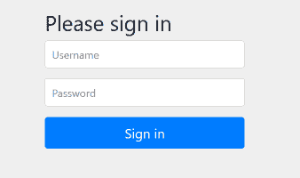

# Spring Boot 登录页面教程

> 原文： [http://zetcode.com/springboot/loginpage/](http://zetcode.com/springboot/loginpage/)

Spring Boot 登录页面教程显示了如何使用默认登录页面。 Spring Security 默认情况下会保护所有 HTTP 端点。 用户必须以默认的 HTTP 形式登录。

为了启用 Spring Boot 安全性，我们将`spring-boot-starter-security`添加到依赖项中。

## Spring Boot 登录页面示例

以下示例显示了如何在 Spring Boot 应用中设置简单的登录页面。

```java
pom.xml
src
├───main
│   ├───java
│   │   └───com
│   │       └───zetcode
│   │           │   Application.java
│   │           └───controller
│   │                   MyController.java
│   └───resources
│           application.properties
└───test
    └───java

```

这是 Spring Boot 应用的项目结构。

`pom.xml`

```java
<?xml version="1.0" encoding="UTF-8"?>
<project xmlns="http://maven.apache.org/POM/4.0.0"
         xmlns:xsi="http://www.w3.org/2001/XMLSchema-instance"
         xsi:schemaLocation="http://maven.apache.org/POM/4.0.0
         http://maven.apache.org/xsd/maven-4.0.0.xsd">
    <modelVersion>4.0.0</modelVersion>

    <groupId>com.zetcode</groupId>
    <artifactId>springbootloginpage</artifactId>
    <version>1.0-SNAPSHOT</version>

    <packaging>jar</packaging>

    <properties>
        <project.build.sourceEncoding>UTF-8</project.build.sourceEncoding>
        <maven.compiler.source>11</maven.compiler.source>
        <maven.compiler.target>11</maven.compiler.target>
    </properties>

    <parent>
        <groupId>org.springframework.boot</groupId>
        <artifactId>spring-boot-starter-parent</artifactId>
        <version>2.1.5.RELEASE</version>
    </parent>

    <dependencies>
        <dependency>
            <groupId>org.springframework.boot</groupId>
            <artifactId>spring-boot-starter-web</artifactId>
        </dependency>

        <dependency>
            <groupId>org.springframework.boot</groupId>
            <artifactId>spring-boot-starter-security</artifactId>
        </dependency>

    </dependencies>

    <build>
        <plugins>
            <plugin>
                <groupId>org.springframework.boot</groupId>
                <artifactId>spring-boot-maven-plugin</artifactId>
            </plugin>
        </plugins>
    </build>
</project>

```

这是 Maven 构建文件。 我们有网络和安全性的入门者。

`resources/application.properties`

```java
spring.main.banner-mode=off
logging.pattern.console=%d{dd-MM-yyyy HH:mm:ss} %magenta([%thread]) %highlight(%-5level) %logger.%M - %msg%n

```

在`application.properties`文件中，我们关闭 Spring Boot 横幅并配置控制台日志记录模式。

`com/zetcode/controller/MyController.java`

```java
package com.zetcode.controller;

import org.springframework.web.bind.annotation.GetMapping;
import org.springframework.web.bind.annotation.RestController;

@RestController
public class MyController {

    @GetMapping("/")
    public String home() {

        return "This is home page";
    }
}

```

我们有一个简单的主页。

我们运行该应用并导航到`localhost:8080`。 我们被重定向到`http://localhost:8080/login`页面。

```java
...
17-06-2019 17:48:45 [main] INFO  org.springframework.boot.autoconfigure.security.servlet.UserDetailsServiceAutoConfiguration.getOrDeducePassword -

Using generated security password: df7ce50b-abae-43a1-abe1-0e17fd81a454
...

```

在控制台中，我们可以看到为默认用户`user`生成的密码。 这些凭据将提供给认证表单。



图：登录表单

Spring 使用 Bootstrap 定义 UI。

```java
spring.security.user.name = admin
spring.security.user.password = s$cret

```

通过这两个选项，我们可以拥有一个新的用户名和密码。 使用这些设置将自动生成的用户关闭。

在本教程中，我们使用了默认的登录表单。 您可能也对相关教程感兴趣： [Spring Boot `@Lazy`教程](/springboot/lazybean/)， [Java 教程](/lang/java/)或列出 [Spring Boot 教程](/all/#springboot)。