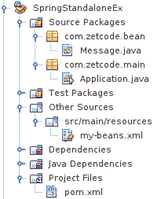

# 独立的 Spring 应用

> 原文： [http://zetcode.com/articles/standalonespring/](http://zetcode.com/articles/standalonespring/)

在本教程中，我们将创建两个简单的 Java Spring 独立应用。 我们将使用 NetBeans 来构建应用。

Spring 是流行的 Java 应用框架。 它提供了用于企业应用编程的各种库和工具。 这也是一个非常好的集成系统，可以帮助将各种企业组件粘合在一起。

Spring `ApplicationContext`是用于为应用提供配置的中央接口。 `ClassPathXmlApplicationContext`是`ApplicationContext`的实现，该实现从位于类路径上的 XML 文件加载配置定义。 `AnnotationConfigApplicationContext`创建一个新的应用上下文，该上下文从给定的带注释的类派生 Bean 定义。

`pom.xml`

```java
<?xml version="1.0" encoding="UTF-8"?>
<project xmlns="http://maven.apache.org/POM/4.0.0" 
         xmlns:xsi="http://www.w3.org/2001/XMLSchema-instance" 
         xsi:schemaLocation="http://maven.apache.org/POM/4.0.0 http://maven.apache.org/xsd/maven-4.0.0.xsd">

    <modelVersion>4.0.0</modelVersion>
    <groupId>com.zetcode</groupId>
    <artifactId>SpringStandaloneEx2</artifactId>
    <version>1.0-SNAPSHOT</version>
    <packaging>jar</packaging>

    <properties>

        <project.build.sourceEncoding>UTF-8</project.build.sourceEncoding>
        <maven.compiler.source>1.8</maven.compiler.source>
        <maven.compiler.target>1.8</maven.compiler.target>
        <spring-version>4.3.0.RELEASE</spring-version>

    </properties>

    <dependencies>

        <dependency>
            <groupId>org.springframework</groupId>
            <artifactId>spring-core</artifactId>
            <version>${spring-version}</version>
        </dependency>

        <dependency>
            <groupId>org.springframework</groupId>
            <artifactId>spring-beans</artifactId>
            <version>${spring-version}</version>
        </dependency>

        <dependency>
            <groupId>org.springframework</groupId>
            <artifactId>spring-context</artifactId>
            <version>${spring-version}</version>
        </dependency>

    </dependencies>

</project>

```

我们将 Maven 构建文件用于两个应用。 它包含必要的 Spring 依赖关系。

## 具有`ClassPathXmlApplicationContext`的 Spring 应用

我们在 NetBeans IDE 中创建一个新的 Maven Java SE 应用。



图：NetBeans 中的 Spring 项目结构

在项目中，有四个文件：`Message.java`，`Application.java`，`my-beans.xml`和`pom.xml`。

`Message.java`

```java
package com.zetcode.bean;

public class Message {

   private String message;

   public void setMessage(String message){

      this.message = message;
   }

   public String getMessage(){

      return message;
   }
}

```

`Message`是我们的应用中使用的简单 Java Bean。

`my-beans.xml`

```java
<?xml version="1.0" encoding="UTF-8"?>

<beans xmlns="http://www.springframework.org/schema/beans"
    xmlns:xsi="http://www.w3.org/2001/XMLSchema-instance"
    xsi:schemaLocation="http://www.springframework.org/schema/beans
    http://www.springframework.org/schema/beans/spring-beans.xsd">

   <bean id="mymessage" class="com.zetcode.bean.Message">
       <property name="message" value="Hello there!"/>
   </bean>

</beans>

```

我们将`Message`类制成 Spring Bean； 现在，它由 Spring 容器管理。 我们还为`message`属性提供了一个值。 `my-beans.xml`位于`src/main/resources`子目录中。

`Application.java`

```java
package com.zetcode.main;

import com.zetcode.bean.Message;
import org.springframework.context.ApplicationContext;
import org.springframework.context.support.ClassPathXmlApplicationContext;

public class Application {

   public static void main(String[] args) {

      ApplicationContext context = 
             new ClassPathXmlApplicationContext("my-beans.xml");

      Message obj = (Message) context.getBean("mymessage");

      String msg = obj.getMessage();
      System.out.println(msg);
   }
}

```

`Application`设置 Spring 应用。

```java
ApplicationContext context = 
        new ClassPathXmlApplicationContext("my-beans.xml");

```

从`my-beans.xml`文件，创建`ApplicationContext`。

```java
Message obj = (Message) context.getBean("mymessage");

```

从应用上下文中，我们检索`Message` bean。

```java
String msg = obj.getMessage();
System.out.println(msg);

```

我们调用 bean 的`getMessage()`方法，并将消息打印到控制台。

```java
Hello there!

```

这是应用的输出。

## 具有`AnnotationConfigApplicationContext`的 Spring 应用

在第二个示例中，我们将使用`AnnotationConfigApplicationContext`创建 Spring `ApplicationContext`。

`Message.java`

```java
package com.zetcode.bean;

import org.springframework.stereotype.Component;

@Component
public class Message {

   private String message = "Hello there!";

   public void setMessage(String message){

      this.message  = message;
   }

   public String getMessage(){

      return message;
   }
}

```

`Message` bean 用`@Component`注解修饰。 此类由 Spring 自动检测。

`Application.java`

```java
package com.zetcode.main;

import com.zetcode.bean.Message;
import org.springframework.beans.factory.annotation.Autowired;
import org.springframework.context.ApplicationContext;
import org.springframework.context.annotation.AnnotationConfigApplicationContext;
import org.springframework.context.annotation.ComponentScan;

@ComponentScan(basePackages = "com.zetcode")
public class Application {

    public static void main(String[] args) {

        ApplicationContext context
                = new AnnotationConfigApplicationContext(Application.class);

        Application p = context.getBean(Application.class);
        p.start();
    }

    @Autowired
    private Message message;
    private void start() {
        System.out.println("Message: " + message.getMessage());
    }
}

```

这是主要的`Application`类。

```java
@ComponentScan(basePackages = "com.zetcode")

```

使用`@ComponentScan`注解，我们告诉 Spring 在哪里寻找组件。

```java
ApplicationContext context
        = new AnnotationConfigApplicationContext(Application.class);

```

`ApplicationContext`由注释创建。

```java
@Autowired
private Message message;
private void start() {
    System.out.println("Message: " + message.getMessage());
}

```

使用`@Autowired`注解，`Message` bean 被注入到`message`变量中。

在本教程中，我们创建了两个独立的 Spring 应用。 第一个使用 XML 文件，第二个使用注释。 您可能也对相关教程感兴趣： [Spring Web 应用简介](/articles/springwebfirst/)， [Spring Boot 优先 Web 应用](/articles/springbootwebfirst/)或 [Java 教程](/lang/java/)。