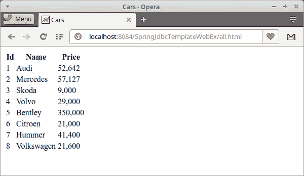

# Spring HikariCP 教程

> 原文： [http://zetcode.com/articles/springhikaricp/](http://zetcode.com/articles/springhikaricp/)

在本教程中，我们将展示如何在经典的 Spring 应用中使用 HikariCP 连接池。 在应用中，我们使用 Spring `JdbcTemplate`连接到 MySQL 数据库。 我们使用 FreeMarker 作为模板引擎。 该应用已部署在 Tomcat 服务器上。

Spring 是用于在 Java 中开发企业应用的流行 Java 应用框架。 这也是一个非常好的集成系统，可以帮助将各种企业组件粘合在一起。

HikariCP 是可靠的高性能 JDBC 连接池。 连接池是数据库系统维护的数据库连接的高速缓存，用于在需要将来对数据库的请求时重用连接。 使用连接池，我们可以大大减少整体资源的使用。

`JdbcTemplate`是一个 Spring 库，可以帮助程序员创建与关系数据库和 JDBC 一起使用的应用。 它会处理许多繁琐且容易出错的底层细节，例如处理事务，清理资源以及正确处理异常。 `JdbcTemplate`在 Spring 的`spring-jdbc`模块中提供。

`cars.sql`

```java
-- SQL for the Cars table

START TRANSACTION;
DROP TABLE IF EXISTS Cars;

CREATE TABLE Cars(Id INTEGER PRIMARY KEY, Name VARCHAR(50), Price INTEGER);
INSERT INTO Cars VALUES(1, 'Audi', 52642);
INSERT INTO Cars VALUES(2, 'Mercedes', 57127);
INSERT INTO Cars VALUES(3, 'Skoda', 9000);
INSERT INTO Cars VALUES(4, 'Volvo', 29000);
INSERT INTO Cars VALUES(5, 'Bentley', 350000);
INSERT INTO Cars VALUES(6, 'Citroen', 21000);
INSERT INTO Cars VALUES(7, 'Hummer', 41400);
INSERT INTO Cars VALUES(8, 'Volkswagen', 21600);
COMMIT;

```

在代码示例中，我们使用此表。

```java
mysql> source cars.sql

```

使用`mysql`命令行工具及其`source`命令，创建`Cars`表。 [MySQL 教程](/databases/mysqltutorial/)提供了有关如何设置和使用 MySQL 数据库的更多信息。

```java
├── pom.xml
└── src
    ├── main
    │   ├── java
    │   │   └── com
    │   │       └── zetcode
    │   │           ├── bean
    │   │           │   └── Car.java
    │   │           ├── service
    │   │           │   └── CarService.java
    │   │           └── web
    │   │              └── MyController.java
    │   ├── resources
    │   │   └── application-context.xml
    │   └── webapp
    │       ├── META-INF
    │       │   └── context.xml
    │       └── WEB-INF
    │           ├── spring-servlet.xml
    │           ├── views
    │           │   ├── allCars.ftl
    │           │   └── index.ftl
    │           └── web.xml
    └── test
        └── java

```

这是项目结构。

`pom.xml`

```java
<?xml version="1.0" encoding="UTF-8"?>
<project xmlns="http://maven.apache.org/POM/4.0.0" 
         xmlns:xsi="http://www.w3.org/2001/XMLSchema-instance" 
         xsi:schemaLocation="http://maven.apache.org/POM/4.0.0 
                             http://maven.apache.org/xsd/maven-4.0.0.xsd">

    <modelVersion>4.0.0</modelVersion>

    <groupId>com.zetcode</groupId>
    <artifactId>SpringJdbcTemplateWebEx</artifactId>
    <version>1.0-SNAPSHOT</version>
    <packaging>war</packaging>

    <name>SpringJdbcTemplateWebEx</name>

    <properties>
        <project.build.sourceEncoding>UTF-8</project.build.sourceEncoding>
        <maven.compiler.source>1.8</maven.compiler.source>
        <maven.compiler.target>1.8</maven.compiler.target>        
        <spring-version>4.3.7.RELEASE</spring-version>
    </properties>

    <dependencies>

        <dependency>
            <groupId>mysql</groupId>
            <artifactId>mysql-connector-java</artifactId>
            <version>5.1.40</version>
        </dependency>              

        <dependency>
            <groupId>org.freemarker</groupId>
            <artifactId>freemarker</artifactId>
            <version>2.3.25-incubating</version>
        </dependency>   

         <!--Needed for freemarker FreeMarkerConfigurer--> 
        <dependency>
            <groupId>org.springframework</groupId>
            <artifactId>spring-context-support</artifactId>
            <version>${spring-version}</version>
        </dependency>                

        <dependency>
            <groupId>com.zaxxer</groupId>
            <artifactId>HikariCP</artifactId>
            <version>2.5.1</version>
        </dependency>      

        <dependency>
            <groupId>org.slf4j</groupId>
            <artifactId>slf4j-simple</artifactId>
            <version>1.7.22</version>
        </dependency>          

        <dependency>
            <groupId>org.springframework</groupId>
            <artifactId>spring-webmvc</artifactId>
            <version>${spring-version}</version>
        </dependency>         

        <dependency>
            <groupId>org.springframework</groupId>
            <artifactId>spring-jdbc</artifactId>
            <version>${spring-version}</version>
        </dependency>              

    </dependencies>

    <build>
        <plugins>
            <plugin>
                <groupId>org.apache.maven.plugins</groupId>
                <artifactId>maven-war-plugin</artifactId>
                <version>2.3</version>
                <configuration>
                    <failOnMissingWebXml>false</failOnMissingWebXml>
                </configuration>
            </plugin>
        </plugins>
    </build>

</project>

```

在此 Maven 构建文件中，我们为 Spring 应用的核心，HikariCP 连接池，FreeMarker 模板引擎，`JdbcTemplate`库和 MySQL 驱动程序提供依赖关系。

`web.xml`

```java
<?xml version="1.0" encoding="UTF-8"?>

<web-app xmlns="http://xmlns.jcp.org/xml/ns/javaee"
         xmlns:xsi="http://www.w3.org/2001/XMLSchema-instance"
         xsi:schemaLocation="http://xmlns.jcp.org/xml/ns/javaee 
                 http://xmlns.jcp.org/xml/ns/javaee/web-app_3_1.xsd"
         version="3.1">

    <servlet>
        <servlet-name>spring</servlet-name>
        <servlet-class>
            org.springframework.web.servlet.DispatcherServlet
        </servlet-class>
        <load-on-startup>1</load-on-startup>
    </servlet>

    <servlet-mapping>
        <servlet-name>spring</servlet-name>
        <url-pattern>*.html</url-pattern>
    </servlet-mapping>    

    <session-config>
        <session-timeout>
            30
        </session-timeout>
    </session-config>
</web-app>

```

在`web.xml`文件中，我们设置了 Spring `DispatcherServlet`。 `DispatcherServlet`是 HTTP 请求处理器的中央调度器。

`context.xml`

```java
<?xml version="1.0" encoding="UTF-8"?>
<Context path="/SpringJdbcTemplateWebEx">

    <Resource name="jdbc/myDs" auth="Container"
              factory="com.zaxxer.hikari.HikariJNDIFactory"
              dataSourceClassName="com.mysql.jdbc.jdbc2.optional.MysqlDataSource"
              dataSource.url="jdbc:mysql://localhost/testdb?useSSL=false"
              type="javax.sql.DataSource"
              minimumIdle="5" 
              maximumPoolSize="10"
              connectionTimeout="300000"
              database="testdb"
              server="localhost"
              dataSource.user="testuser"
              dataSource.password="test623"
              dataSource.cachePrepStmts="true"
              dataSource.prepStmtCacheSize="250"
              dataSource.prepStmtCacheSqlLimit="2048"
              closeMethod="close"
    />

</Context>

```

Tomcat 的`context.xml`文件包含数据源定义。 数据源使用 HikariCP 连接池。

`spring-servlet.xml`

```java
<?xml version="1.0" encoding="UTF-8"?>

<beans xmlns="http://www.springframework.org/schema/beans"
       xmlns:xsi="http://www.w3.org/2001/XMLSchema-instance"
       xmlns:mvc="http://www.springframework.org/schema/mvc"
       xmlns:context="http://www.springframework.org/schema/context"
       xsi:schemaLocation="http://www.springframework.org/schema/mvc http://www.springframework.org/schema/mvc/spring-mvc.xsd
   http://www.springframework.org/schema/beans http://www.springframework.org/schema/beans/spring-beans.xsd
   http://www.springframework.org/schema/context http://www.springframework.org/schema/context/spring-context.xsd">

    <context:component-scan base-package="com.zetcode" />
    <import resource="classpath:application-context.xml" />

    <bean id="freemarkerConfig" class="org.springframework.web.servlet.view.freemarker.FreeMarkerConfigurer">
        <property name="templateLoaderPath" value="/WEB-INF/views/"/>
    </bean>

    <bean id="viewResolver" class="org.springframework.web.servlet.view.freemarker.FreeMarkerViewResolver">
        <property name="cache" value="true"/>
        <property name="prefix" value=""/>
        <property name="suffix" value=".ftl"/>
    </bean>   

</beans>

```

在 spring servlet 上下文 XML 文件中，我们定义了两个 bean：`freemarkerConfig`和`viewResolver`。 这些是 FreeMarker 的配置 bean。 `spring-servlet.xml`位于`WEB-INF`子目录中。

```java
<context:component-scan base-package="com.zetcode" />

```

我们启用`com.zetcode`封装的组件扫描。

```java
<import resource="classpath:application-context.xml" />

```

我们导入另一个上下文文件，称为`application-context.xml`。 它位于`src/main/resources`目录中的类路径上。

`application-context.xml`

```java
<?xml version="1.0" encoding="UTF-8"?>
<beans xmlns="http://www.springframework.org/schema/beans"
       xmlns:xsi="http://www.w3.org/2001/XMLSchema-instance"
       xsi:schemaLocation="http://www.springframework.org/schema/beans 
                          http://www.springframework.org/schema/beans/spring-beans.xsd">

    <bean id="dataSource" class="org.springframework.jndi.JndiObjectFactoryBean">
        <property name="jndiName" value="java:comp/env/jdbc/myDs"/>
    </bean>    

    <bean id="jdbcTemplate" class="org.springframework.jdbc.core.JdbcTemplate">
        <property name="dataSource" ref="dataSource"/>
    </bean>    

</beans>

```

在`application-context.xml`中，我们定义了两个 bean：`dataSource`和`jdbcTemplate`。

`Car.java`

```java
package com.zetcode.bean;

public class Car {

    private int Id;
    private String Name;
    private int Price;

    public int getId() {
        return Id;
    }

    public void setId(int Id) {
        this.Id = Id;
    }

    public String getName() {
        return Name;
    }

    public void setName(String Name) {
        this.Name = Name;
    }

    public int getPrice() {
        return Price;
    }

    public void setPrice(int Price) {
        this.Price = Price;
    }

    @Override
    public String toString() {
        return "Car{" + "Id=" + Id + ", Name=" + 
                Name + ", Price=" + Price + '}';
    }
}

```

这是一个`Car`类。 数据库表中的一行将映射到此类。

`CarService.java`

```java
package com.zetcode.service;

import com.zetcode.bean.Car;
import java.util.List;
import org.springframework.beans.factory.annotation.Autowired;
import org.springframework.jdbc.core.BeanPropertyRowMapper;
import org.springframework.jdbc.core.JdbcTemplate;
import org.springframework.stereotype.Service;

@Service
public class CarService {

    @Autowired
    public JdbcTemplate jdbcTemplate;

    public List<Car> getAllCars() {

        String sql = "SELECT * FROM Cars";

        List<Car> cars = jdbcTemplate.query(sql, 
                new BeanPropertyRowMapper(Car.class));
        return cars;
    }
}

```

`CarService`是一个服务类，其中包含一种从数据库中检索所有汽车的方法。

```java
@Autowired
public JdbcTemplate jdbcTemplate;

```

`JdbcTemplate`注入了`@Autowired`注解。

```java
List<Car> cars = jdbcTemplate.query(sql, 
        new BeanPropertyRowMapper(Car.class));

```

使用`JdbcTemplate`的`query()`方法，我们执行 SQL 查询。 使用`BeanPropertyRowMapper`将结果对象映射到`Car`对象。

`MyController.java`

```java
package com.zetcode.web;

import com.zetcode.bean.Car;
import com.zetcode.service.CarService;
import java.util.List;
import org.springframework.beans.factory.annotation.Autowired;
import org.springframework.stereotype.Controller;
import org.springframework.ui.Model;
import org.springframework.web.bind.annotation.RequestMapping;
import org.springframework.web.bind.annotation.RequestMethod;
import org.springframework.web.servlet.ModelAndView;

@Controller
public class MyController {

    @Autowired
    private CarService carService;

    @RequestMapping("/index")
    public String index(Model model) {

        return "index";
    }

    @RequestMapping(value = "/all", method = RequestMethod.GET)
    public ModelAndView all() {

        List<Car> cars = carService.getAllCars();

        ModelAndView model = new ModelAndView("allCars");
        model.addObject("cars", cars);

        return model;
    }
}

```

`MyController`是控制器类。 它具有两个请求 URL 的映射：`/index`和`/all`。

```java
@Autowired
private CarService carService;

```

注入`CarService`。

```java
@RequestMapping("/index")
public String index(Model model) {

    return "index";
}

```

通过返回`index.ftl`文件来解决此请求。 这些视图位于`WEB-INF/views`目录中。

```java
@RequestMapping(value = "/all", method = RequestMethod.GET)
public ModelAndView all() {

    List<Car> cars = carService.getAllCars();

    ModelAndView model = new ModelAndView("allCars");
    model.addObject("cars", cars);

    return model;
}

```

在这里，我们调用`CarService`的`getAllCars()`方法并创建`ModelAndView`对象。 所检索的数据被发送到`allCars.ftl`模板。

`index.ftl`

```java
<!DOCTYPE html>
<html>
    <head>
        <title>Home page</title>
        <meta charset="UTF-8">
        <meta name="viewport" content="width=device-width, initial-scale=1.0">
    </head>
    <body>
        <p>Showing <a href="all.html">all cars</a></p>
    </body>
</html>

```

这是`index.ftl`文件。

`allCars.ftl`

```java
<!DOCTYPE html>
<html>
    <head>
        <title>Cars</title>
        <meta charset="UTF-8">
        <meta name="viewport" content="width=device-width, initial-scale=1.0">
        </head>
    <body>

        <table>
            <tr>
                <th>Id</th>  
                <th>Name</th>  
                <th>Price</th>
            </tr>        

            <#list cars as car>
                <tr>
                    <td>${car.id}</td> 
                    <td>${car.name}</td> 
                    <td>${car.price}</td>
                </tr>
            </#list>        
        </table>                
    </body>
</html>

```

该模板文件处理从数据库发送的数据。

```java
<#list cars as car>

```

`#list`指令列出了数据集合。



图：显示所有汽车

MySQL 数据库中的数据显示在 Opera 浏览器中。

在本教程中，我们创建了一个经典的 Spring 应用，该应用使用`JdbcTemplate`对 MySQL 数据库执行了 SQL 语句。 我们使用了 HikariCP 连接池。 Spring 应用使用 FreeMarker 模板引擎，并已部署在 Tomcat 服务器上。 您可能也对这些相关教程感兴趣：[使用 HikariCP 连接池](/articles/hikaricp/)， [`JdbcTemplate`教程](/db/jdbctemplate/)， [Spring 单例范围 bean 教程](/spring/singletonscope/)， [Spring Web 应用简介](/articles/springwebfirst/) ， [Spring Boot 第一个 Web 应用](/articles/springbootwebfirst/)或 [Java 教程](/lang/java/)。