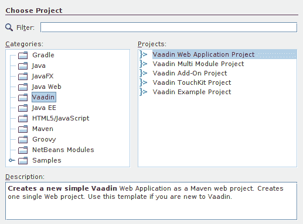

# Vaadin 框架介绍

> 原文： [http://zetcode.com/vaadin/intro/](http://zetcode.com/vaadin/intro/)

本教程介绍 Vaadin Web 框架。

## Vaadin 框架

Vaadin 是用于构建单页 Web 应用的流行 Java 框架。 它由一家专门从事富 Internet 应用设计和开发的芬兰公司开发。 估计有 15 万开发人员使用 Vaadin。 它的开发始于 2002 年。

## Vaadin 框架功能

以下是 Vaadin 功能的列表：

*   这是一个 Java Web 框架
*   概念上类似于 Java Swing
*   允许构建不带 HTML 和 JavaScript 的 Web 应用
*   基于 Java Servlet 构建
*   包含大量组件和寡妇
*   提供可定制的外观
*   在客户端和服务器之间使用异步消息
*   使用服务器端编程模型
*   具有 Eclipse，NetBeans 和 IntelliJ 的插件
*   使用 Google Web Toolkit 呈现结果网页
*   提升代码质量和安全性

## Vaadin NetBeans

NetBeans 包含一个用于创建 Vaadin 应用的插件。 我们转到工具/插件并安装 Vaadin 插件。 然后，我们重新启动 NetBeans。



Figure: Vaadin new project

安装 Vaadin 插件后，NetBeans 中将出现一个新的 Vaadin 项目类别。 要创建一个新的 Vaadin 项目，我们转到 File / New Project / Vaadin 并选择 Vaadin Web Application Project。

## Vaadin 简单示例

以下是一个简单的 Vaadin 应用，该应用使用 Vaadin `Label`组件显示文本。

```java
$ tree
.
├── nb-configuration.xml
├── pom.xml
├── README.md
└── src
    └── main
        ├── java
        │   └── com
        │       └── zetcode
        │           └── simple
        │               └── MyUI.java
        ├── resources
        │   └── README
        └── webapp
            ├── META-INF
            │   └── context.xml
            └── VAADIN
                └── themes
                    └── mytheme
                        ├── addons.scss
                        ├── favicon.ico
                        ├── mytheme.scss
                        └── styles.scss

```

这是 Vaadin Web 应用的项目结构。 请注意为我们自动创建的主题。

`MyUI.java`

```java
package com.zetcode.simple;

import javax.servlet.annotation.WebServlet;

import com.vaadin.annotations.Theme;
import com.vaadin.annotations.VaadinServletConfiguration;
import com.vaadin.server.VaadinRequest;
import com.vaadin.server.VaadinServlet;
import com.vaadin.ui.Label;
import com.vaadin.ui.UI;
import com.vaadin.ui.VerticalLayout;

@Theme("mytheme")
public class MyUI extends UI {

    @Override
    protected void init(VaadinRequest vaadinRequest) {

        VerticalLayout layout = new VerticalLayout();

        Label lbl = new Label("Simple example");
        lbl.setDescription("This is a Label component");

        layout.addComponents(lbl);

        setContent(layout);
    }

    @WebServlet(urlPatterns = "/*", name = "MyUIServlet", asyncSupported = true)
    @VaadinServletConfiguration(ui = MyUI.class, productionMode = false)
    public static class MyUIServlet extends VaadinServlet {
    }
}

```

`MyUI`是应用入口点。 UI 可以是浏览器窗口（或选项卡），也可以是嵌入 Vaadin 应用的 HTML 页面的一部分。

```java
@Theme("mytheme")

```

使用`@Theme`批注，我们指定应用的主题。 系统会自动为我们创建一个默认的`mytheme`。

```java
VerticalLayout layout = new VerticalLayout();

```

Vaadin 中的组件放置在布局管理器中。 `VerticalLayout`将组件放在一列中。 由于我们只有一个`Label`组件，因此选择哪个布局管理器都没关系。

```java
Label lbl = new Label("Simple example");

```

创建了一个新的`Label`组件。 标签显示不可编辑的文本。

```java
lbl.setDescription("This is a Label component");

```

通过`setDescription()`方法，我们为标签组件添加了一个工具提示。

```java
layout.addComponents(lbl);

```

标签通过`addComponents()`方法添加到布局中。

```java
setContent(layout);

```

最后，使用`setContent()`将布局添加到 UI。

```java
@WebServlet(urlPatterns = "/*", name = "MyUIServlet", asyncSupported = true)
@VaadinServletConfiguration(ui = MyUI.class, productionMode = false)
public static class MyUIServlet extends VaadinServlet {
}

```

从此代码摘录中可以看到，Vaadin 框架是基于 Java Servlet 技术构建的。


Figure: Vaadin Label

在屏幕截图中，我们可以看到`Label`组件及其工具提示。

在本教程中，我们介绍了 Vaadin 框架。 您可能也对相关教程感兴趣： [Vaadin Button 教程](/vaadin/button/)， [Vaadin CheckBox 教程](/vaadin/checkbox/)， [Vaadin ComboBox 教程](/vaadin/combobox/)， [Vaadin TextArea 教程](/vaadin/textarea/)， [Vaadin 滑块教程](/vaadin/slider/)， [Java 教程](/lang/java/)。